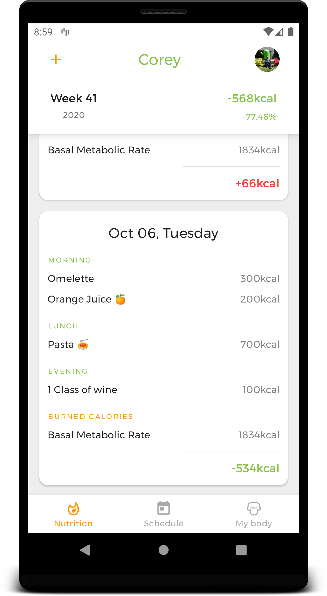
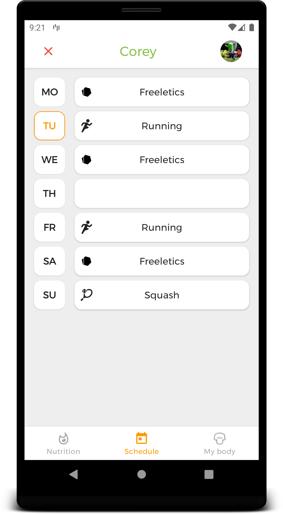
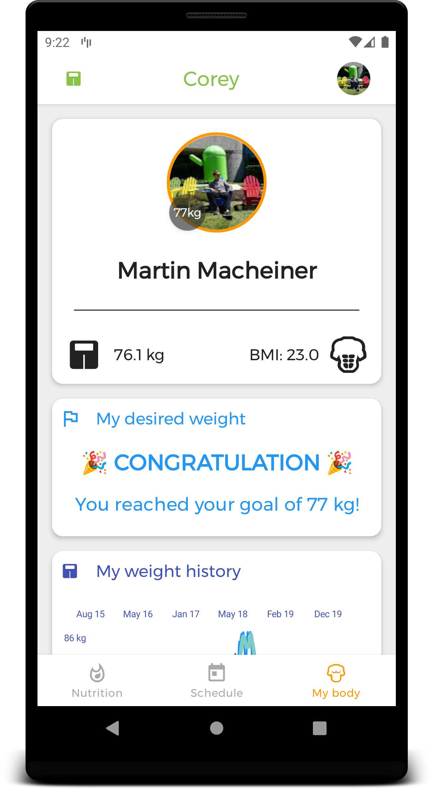

# Corey - Personal Fitness Mate

Note that this repository is just for my personal usage. It's not intended to be published anywhere.
All of my personal health data is stored in my Firebase account.

| Nutrition | Schedule | My body |
|:-|:-|:-|
|  |   |  |

### Version 4.3
- [ ] Improved website (Do necessary changes in the app, if required)

### Version 4.2
- [ ] External workout repository implementation (Google Fit or Garmin or Manual)

### Version 4.1
- [x] Kcal lookup service

### Version 4.0
- [x] Improve basically the whole code base (use ViewModels)
- [x] Drastically simplify navigation
- [x] Add nutrition history as separate tab
- [x] Remove workout feature since it's no longer used
- [x] Clean up data layer (Do not subscribe there observables, rather in the ViewModel)

## Version 2.2
- [x] Fix notification icons + delivery
- [x] Fix git structure
- [x] Equipment support for exercises and workouts
- [x] Improved scheduling (remove swipe-to-dismiss)
- [x] Web UI

## Version 2.1
- [x] Settings entry for daily notifications
- [x] Main ViewPager
- [x] Splash screen loading
- [x] Fix Wear layout
- [x] Shrink down ScheduleAdapter code
- [x] 100% Kotlin code + structure refactoring (base classes)
- [x] Refactor BodyFragment code
- [x] Bug in SliderPreference (Kotlin Nullability)
- [x] Replace deprecated watch connection code
- [x] Wear Support Library instead of deprecated code
- [x] Get rid off Realm dependency
- [x] Replace deprecated firebase login code
- [x] Use ActionBar layout like Dante
- [x] Introduce abstract utility Activities and Fragments
